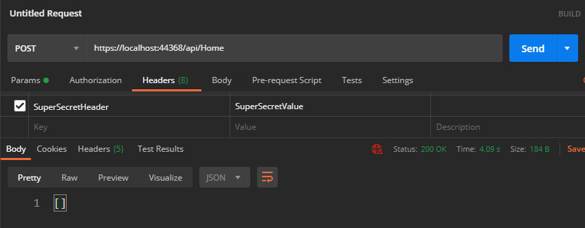

<p align="center">
  
</p>

# InvisibleApi 
I designed & developed this library to help add an extra layer of security for private API endpoints that can only be used/visible to internal consumers and testing frameworks.

## Introduction
When designing APIs there are so rules that govern APIs control of their own resources. For instance, an API endpoint that posts `Student` model and deletes that model might be allowed to publically expose a `POST` endpoint to register students but it shouldn't allow external consumers to delete records from its storage.

What that basically means is that if we are running End-to-End testing on a particular API endpoint, we may need to clean up all test data automatically after the test is over. But in order for that to happen engineers either have to give access to the test bits to the database storage or expose public API endpoints to delete a particular resource by its `Id`.


The problem with allowing any resource other than the owning API to access storage is that it puts the entire resource at risk of deadlocks, overwrites and many other issues that occur when two difference clients are writing to the same storage resource.

Using In-Memory databases unfortunatley doesn't give the guarantee that a running instance in production is in healthy state from an integration standpoint.

A solution that allows proper way of accessing and deleting resources without having to expose private endpoints that offer non-public capabilities is required to execute a successful end-to-end testing process.

## Extra Layer of Security
There are two very common ways hackers today gain access to particular APIs:

### Compromised Client
Hackers may compromise an existing client or consumer of your API to intercept communications, steal access token and identify endpoints in your system that can be attacked or compromised to gain access to your internal data.

Internal testing systems require access to particular endpoints that are not meant for public access - but following a standardized API naming convention may make it easier for a hacker to predict that an api endpoint such as `POST` `/api/students` will have its equivelant of delete operation such as `Delete` `api/students/{studentId}`. 

### Network Scanning/Discovery
The other capability hackers may use to discover weakpoints in your system is to scan your network for open ports, API endpoints or any other vunlerabilities that may expose an avaialble resource or access gateway to your system.

The issue with returning a `403 Unauthorized` error is that it simply gives a challenge to hackers to try and breakthrough the protected endpoint.

But if a particular endpoint that was discovered by scanning the network returned `404 NotFound` its more likely for a hacker or an automated discovery system to move along without having to think twice about attempting to access that endpoint again.

That is simply because the endpoint without the proper headers will masquerade itself as invisible - returning `404 NotFound` to indicate there's nothing to access at that particular point.


## The Solution
Invisible API allows ASP.NET Core API developers to configure particular endpoints to become invisible unless the request contained very specific header values.

Here's how it works:

## Setting Things Up
Engineering and Development experiences were the top priority in the process of building this library. You will notice at first glance the simplicity of setting things up. Let's get started!

### Nuget Package
First of all make sure you navigate and install InvisibleApi from nuget.org or from Visual Studio

### Setting Up InvisibleApi Configurations
When I designed this library, I wanted to allow engineers to have all their invisible APIs configurations sitting in one place so its easier to manage, here's you you can do that:

In your `Startup.cs` file go ahead and add your invisible apis configurations or profiles as follows:

```csharp
public void Configure(IApplicationBuilder app, IWebHostEnvironment env)
{
        ...
            app.UseInvisibleApis(
                new List<InvisibleApiConfiguration>
                {
                    new InvisibleApiConfiguration
                    {
                        Endpoint = "/api/students",
                        HttpVerb = "DELETE",
                        Header = "SuperSecretHeader",
                        Value = "SuperSecretValue"
                    }
                },
                new List<InvisibleApiProfile>
                {
                    new InvisibleApiProfile
                    {
                        Name = "ProfileName",
                        Header = "SuperSecretHeader",
                        Value = "SuperSecretValue"
                    }
                });
        ...
}
```

Note: Both configurations and profiles are not necessary. You can use one or the other or both.

The invisible API configuration will give you the capability to configure multiple API endpoints, with multiple HttpVerbs all in one spot.

You can also assign multiple headers and header values for the same API endpoint - whichever one is used will unveil your API endpoint.

Alternatively you can setup invisible api profiles that can be used in conjunction with an InvisibleApi attribute to determine if the endpoint can be accessed based on one or many profiles setup.

```csharp
[ApiController]
[Route("api/[controller]")]
public class StudentsController : ControllerBase
{
    ...
        [HttpPost]
        [InvisibleApi("ProfileName")]
        public ActionResult<string> Post() =>
            Ok("Posted student data!");
    ...
}
```

### Testing
Now, if we hit the `GET api/home` endpoint with no specified Invisible API configurations the outcome would be as follows:

#### Without Headers (Invisible)


#### With Headers (Visible)


As you can see above, the API endpoint makes itself invisible (404 Not Found) if the header values are not provided, and then it shows itself if the configured header values are provided.

#### Using Attributes (Visible)


### Notice
It's important to understand that the InvisibleApi mechanism doesn't replace the existing practices of security patterns - it's important to understand that it only adds an additional layer of security on existing API endpoints in case the token was compromised for whatever reason or the endpoint was discoverd through scanning or discovery.

## How Does it Work?
If you haven't checked the source code already, InvisibleApi takes advantage of the powerful features of ASP.NET Middleware to intercept any incoming requests before they actually hit your API endpoints and decide whether to allow the request to go through to your resources/endpoints or not.

## Final Note
This library is experimental - use at your own risk, but feel free to reach out and ask any questions if you have any, or simply just open an issue on this repo and I will take a look at it as soon as possible.

You can also email me on the following address: hassanhabib@live.com